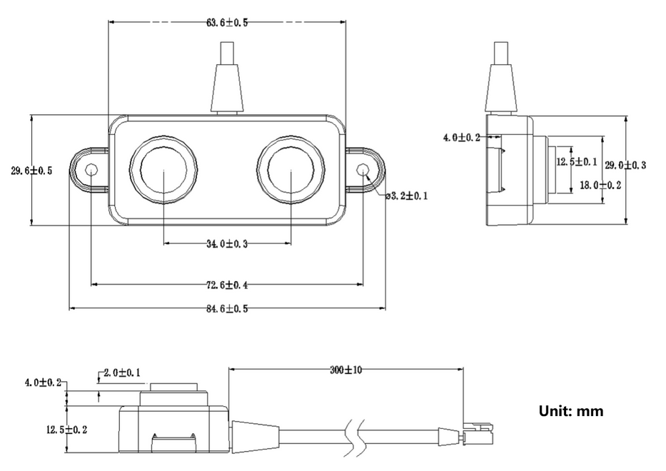
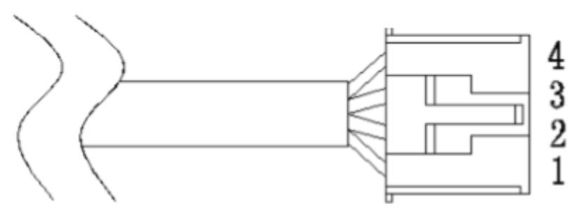
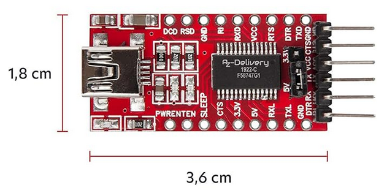
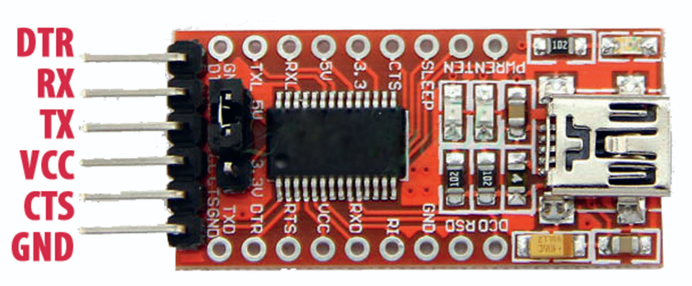

# Ultrasonic A02YYUW sensor configuration using the TTL convertor

This package connects an ultrasonic sensor using the TTL convertor and provide the data in ROS2 topic. 

## Ultrasonic A02YYUW sensor

### Features

- Waterproof and dustproof (IP67)
- Operating range: 3.3~5V
- Average current rate: 8mA
- Standby current rate: <5mA
- Detection range: 3~450cm
- Blind zone distance: 3cm
- Sensing angle: 60°
- Output: UART
- Response Time: 100ms
- Probe center frequency: 40K(U+00B1)1.0K
- Operating temperature: -15~60°C
- Storage temperature: -25~80°C
- Integrated signal processing
- Band rate: 9600bit/s

### Dimension


### Pinout


|Label  |Name   |Description        |
|------:|:-----:|:------------------|
|1      |VCC    |Power              |   
|2      |GND    |Ground             |
|3      |RX     |Processes Vales    |
|4      |TX     |UART Output        |

For more information about the sensor, please refer to official wiki page for [A02YYUW Sensor](https://wiki.dfrobot.com/_A02YYUW_Waterproof_Ultrasonic_Sensor_SKU_SEN0311) on DFRobot website. 

## FT232-AZ USB to TTL Adapter

### Features

- Operating range: 3.3V or 5V (can be set using the jumper on the board)
- Average current rate: 24mA
- Operating temperature: -40~85°C
- Standby temperature: -65~150°C
- Interface: UART
- Chip: FT232-AZ
- Data connection: Mini-USB-B cable

### Dimension


### Pinout


For more information about the adapter, please refer to [FT232-AZ USB to TTL Serial Adapter](https://www.az-delivery.de/en/products/ftdi-adapter-ft232rl?variant=36542809426) on AZ-Delivery website. 


## Features
- Publishes distance data from the sensor
- Configurable sensor pins
- Works with FT232H or microcontroller interface

## Usage

```bash
ros2 run ultrasonic_ros2 ultrasonic_node
``` 

<!--## References

1. [Ultrasonic A02YYUW Sensor Datasheet](https://wiki.dfrobot.com/_A02YYUW_Waterproof_Ultrasonic_Sensor_SKU_SEN0311)

-->